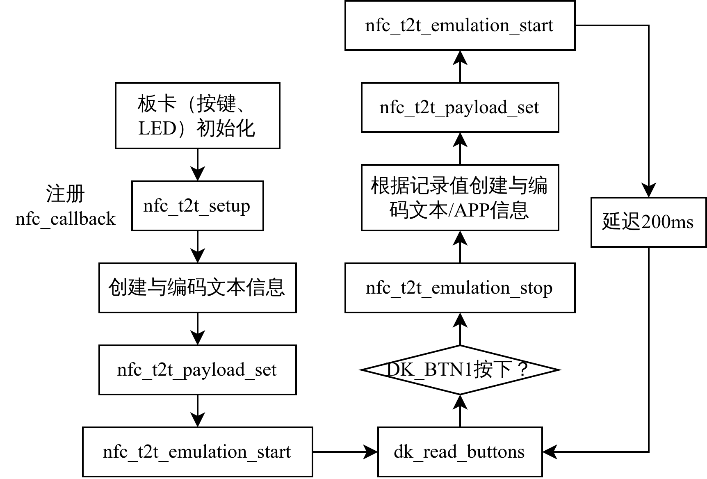

# nRF7002-DK NFC function switching

基于nRF7002-DK，使用nRF Connect SDK `v2.4.2` 开发，使用NFC外设，实现NFC记录英文文本信息、中文文本信息与打开安卓应用三个功能，并可通过按键切换，通过手机NFC触碰即可触发。

# 📦 Prerequisites

1. nRF Connect SDK `v2.4.2`
2. 环境安装参见 [官网文档](https://developer.nordicsemi.com/nRF_Connect_SDK/doc/latest/nrf/index.html)

# 🛠️ How to run

1. 激活 `west` 工具所在的Python虚拟环境
2. 进入 `ncs` workspace
3. 编译工程
   
    ``` shell
    west build <PATH-TO-PROJECT> -d <PATH-TO-PROJECT>/build
    ```

4. 下载程序

    ``` shell
    west flash -d <PATH-TO-PROJECT>/build
    ```

5. 由于已经在 `CMakeLists.txt` 中。设置 `set(BOARD nrf7002dk_nrf5340_cpuapp)` ，因此无需在编译时指定 `-b` 。

# 📜 Documentation

## ⛓️ Workflow



## 📽️ More details

1. 项目详细说明，[CSDN：基于nRF7002-DK的NFC功能切换系统(nRF Connect SDK+NFC)](https://blog.csdn.net/weixin_46422143/article/details/132958016)
2. 项目效果演示，[B站：基于nRF7002-DK的NFC功能切换系统](https://www.bilibili.com/video/BV1qk4y1F7KJ)
